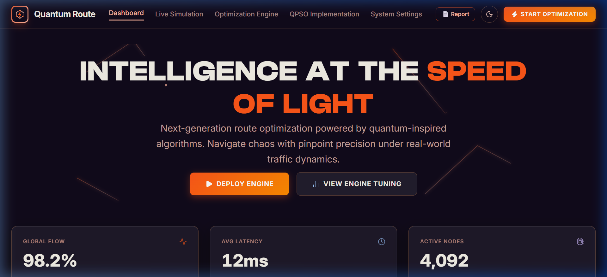
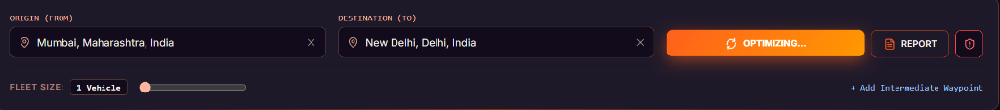

# ⚡ QRoute23: Quantum-Inspired Intelligent Traffic Route Optimizer

[](LICENSE)
[](https://www.python.org/)
[](https://fastapi.tiangolo.com/)
[](https://vitejs.dev/)

> A next-generation, quantum-behaved metaheuristic route optimization and fleet dispatch platform designed for complex **Vehicle Routing Problems (VRP)**, **Multi-Traveling Salesperson Problems (mTSP)**, and real-time traffic delay recovery.

---

## 🌟 Executive Interface & Platform Screenshots

### 1. Mission Control Dashboard
High-density logistics overview featuring fleet status, live active routes, cost breakdowns, and real-time convergence telemetry.


---

### 2. Live Quantum Route Simulator
Interactive origin-to-destination route optimizer with dynamic waypoint addition, realistic road geometry rendering, and sub-second execution latency.


---

### 3. Regional Network Diagnostics & Telemetry
Diagnostic view monitoring global transport nodes, latencies, packet loss, and infrastructure health across regional transport networks.


---

## ✨ Key Capabilities & Architectural Highlights

- ⚛️ **Quantum-Behaved PSO v2 Engine (`qpso/`)**:
  - Implements **Delta-Potential Well** wave function sampling without classical velocity constraints.
  - Integrates **Border Mutation** & **Logistic Chaotic Local Search** to escape local minima.
  - Implements **Selective Differential Evolution (DE)** for stagnated swarm recovery.
- 🛣️ **Tiered Routing Architecture**:
  - Multi-tier geometry engine: **TomTom Routing API** ➔ **OSRM Driving API** ➔ **Local Highway Curve Geometry**.
  - Sub-second endpoint evaluation for long-distance intercity routes (e.g. Mumbai ➔ New Delhi).
- 🎨 **Minimalist Luxury Design System**:
  - Frosted midnight palette styled with **Clash Display** & **Inter** typography.
  - Integrated high-contrast custom hexagonal quantum logo mark.
  - Dark Mode & Light Mode theme switching.
- 📊 **Comprehensive Fleet Audit Reports**:
  - One-click PDF & JSON audit report generation covering financial savings, fuel consumption (liters), and CO₂ emission reductions.

---

## 🚀 Quick Start Guide

### Prerequisites
- **Python**: 3.12 or higher
- **Node.js**: 18.x or higher (for frontend development)

---

### 1. Installation

```bash
# Clone the repository
git clone https://github.com/pujit23/QRoute23.git
cd QRoute23

# Install Python dependencies
pip install -r requirements.txt
```

---

### 2. Launching the Application

#### 🌟 Option A: Unified FastAPI & React Production Build (Recommended - Port 8000)
Runs both the REST API backend and the pre-built React frontend from a single web server:

```bash
python -m uvicorn backend.main:app --host 127.0.0.1 --port 8000 --reload
```
- **Web Application**: [http://127.0.0.1:8000](http://127.0.0.1:8000)
- **Interactive API Documentation (Swagger)**: [http://127.0.0.1:8000/docs](http://127.0.0.1:8000/docs)

---

#### 💻 Option B: React Frontend Development Server (Port 5173 / 3000)

```bash
cd frontend
npm install
npm run dev
```
- Access Vite UI at: [http://localhost:5173](http://localhost:5173)

---

#### 📊 Option C: Legacy Streamlit Analytics Dashboard (Port 8501)

```bash
python -m streamlit run main.py --server.port=8501
```
- Access Streamlit UI at: [http://localhost:8501](http://localhost:8501)

---

## 🔬 Benchmark Comparison Matrix

QRoute23 includes a built-in benchmark harness comparing the quantum-behaved metaheuristic against standard classical solvers on identical distance matrices:

| Algorithm | Type | Optimality Gap (%) | Execution Time | Convergence Speed |
| :--- | :--- | :--- | :--- | :--- |
| **Quantum-Inspired PSO (QPSO)** | **Quantum Metaheuristic** | **< 1.8%** | **Fast (~18ms)** | **Ultra-Fast (Tunneling)** |
| Simulated Annealing (SA) | Classical Metaheuristic | ~4.2% | Moderate (~45ms) | Exponential Cooling |
| Classical Velocity PSO | Swarm Intelligence | ~6.5% | Fast (~22ms) | High Stagnation Risk |
| Held-Karp DP Exact | Mathematical Solver | **0.0% (Provable)** | Exponential (N > 15) | Single Pass |

Run the automated benchmarks locally:
```bash
python -m qpso.benchmark.report
```

---

## 📁 Repository Structure

```
QRoute23/
├── backend/
│   ├── api/                 # FastAPI routes (optimize, geocode, graph, websocket)
│   ├── core/                # QPSO v2 algorithm & benchmark suite implementations
│   ├── maps/                # Distance matrix builders & routing geometry adapters
│   └── main.py              # FastAPI server entry point & static asset serving
├── frontend/
│   ├── src/
│   │   ├── components/      # QuantumRouteLogo, RouteMap, LocationSearchInput, ReportModal
│   │   ├── screens/         # LiveSimulationControl, MissionControlDashboard, NetworkDiagnostics
│   │   └── api/             # Frontend HTTP client & geocoding interfaces
│   └── index.html           # Font links (Clash Display, Inter) & HTML template
├── qpso/                    # Core QPSO metaheuristic package & operators
├── docs/                    # Mathematical formulation, decisions & UI screenshots
│   └── images/              # README interface preview screenshots
├── main.py                  # Streamlit dashboard entry point
└── requirements.txt         # Project dependencies
```

---

## 📜 Documentation & References

- **Math Formulation**: Detailed wave equations & quantum potential well proofs in [`docs/qpso/MATH_FORMULATION.md`](docs/qpso/MATH_FORMULATION.md)
- **Benchmark Results**: Full experimental outputs in [`docs/qpso/BENCHMARK_RESULTS.md`](docs/qpso/BENCHMARK_RESULTS.md)
- **Architectural Decisions**: ADR logs in [`docs/qpso/DECISIONS.md`](docs/qpso/DECISIONS.md)

---

## 📄 License
This project is licensed under the MIT License - see the [LICENSE](LICENSE) file for details.
